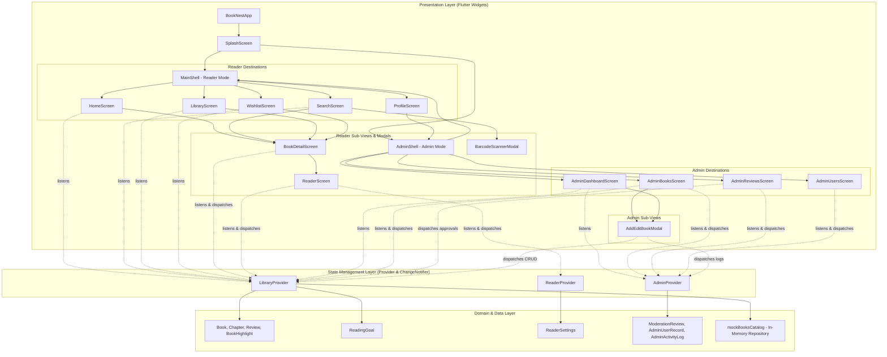
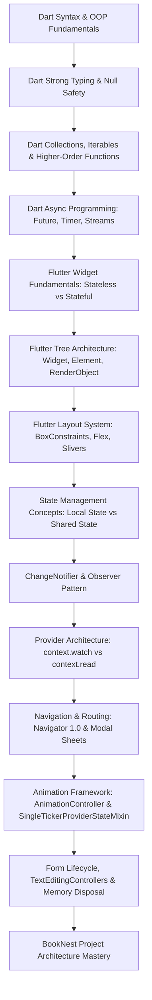
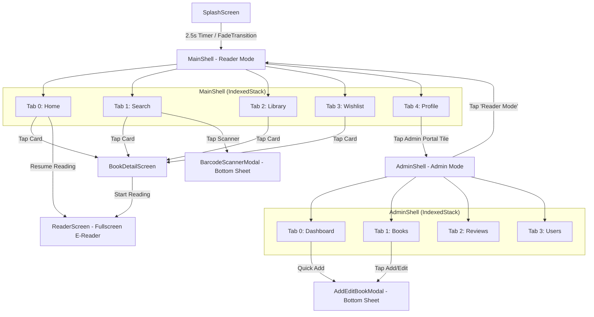
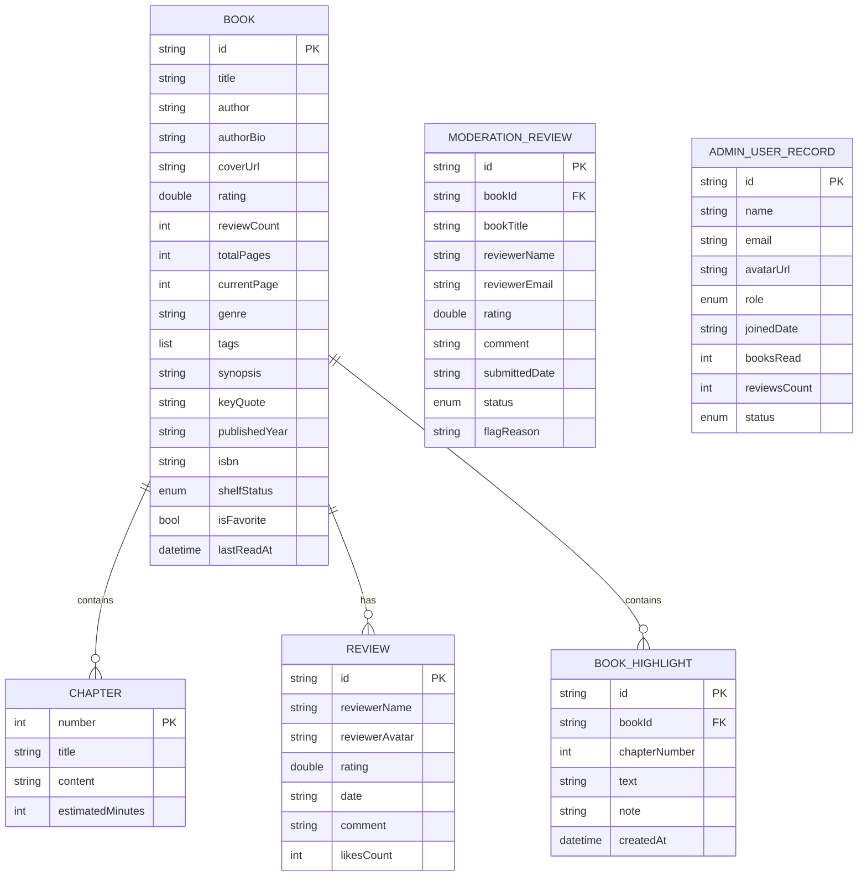

# BookNest: Complete Architectural Autopsy, System Anatomy & Deep Learning Guide

> **Project Name:** BookNest (Digital Library Management & Archival Reading Sanctuary)  
> **Platform Target:** Flutter (iOS, Android, Web, macOS, Linux, Windows)  
> **Target Audience:** Readers, Academic Curators, and Library System Administrators  
> **Repository Root:** `/Users/princevaviya/Documents/booknest`  
> **Document Purpose:** Complete structural autopsy, reverse-engineered codebase breakdown, execution traces, and first-principles pedagogical curriculum.

---

## TABLE OF CONTENTS

1. [Executive System Summary](#1-executive-system-summary)
2. [Deliverable 1: Complete Project Architecture Diagram](#2-deliverable-1-complete-project-architecture-diagram)
3. [Deliverable 2: Dependency & Package Explanation](#3-deliverable-2-dependency--package-explanation)
4. [Deliverable 3: File-by-File Responsibility Map](#4-deliverable-3-file-by-file-responsibility-map)
5. [Deliverable 4: Feature-by-Feature Execution Flow](#5-deliverable-4-feature-by-feature-execution-flow)
6. [Deliverable 5: Prerequisite Knowledge Tree](#6-deliverable-5-prerequisite-knowledge-tree)
7. [Deliverable 6: Deep Teaching Curriculum](#7-deliverable-6-deep-teaching-curriculum)
8. [Deliverable 7: Top 20 Concepts Before Modifying Codebase](#8-deliverable-7-top-20-concepts-before-modifying-codebase)
9. [Part 1: Complete Project Inventory](#part-1--complete-project-inventory)
10. [Part 2: Technology Stack Identification Table](#part-2--technology-stack-identification-table)
11. [Part 3: Pubspec.yaml & Lockfile Deep Dive](#part-3--pubspecyaml--lockfile-deep-dive)
12. [Part 4: Architectural Dependency Graphs](#part-4--architectural-dependency-graphs)
13. [Part 5: Dart Prerequisites from First Principles](#part-5--dart-prerequisites-from-first-principles)
14. [Part 6: Flutter Engine & Rendering Pipeline Mechanics](#part-6--flutter-engine--rendering-pipeline-mechanics)
15. [Part 7: Widget Tree Hierarchy & Autopsy](#part-7--widget-tree-hierarchy--autopsy)
16. [Part 8: State Management Anatomy (ChangeNotifier + Provider)](#part-8--state-management-anatomy-changenotifier--provider)
17. [Part 9: Navigation & Routing Graph](#part-9--navigation--routing-graph)
18. [Part 10: Data Layer & Repository Mechanics](#part-10--data-layer--repository-mechanics)
19. [Part 11: Schema Reconstruction & Entity Relationships](#part-11--schema-reconstruction--entity-relationships)
20. [Part 12: Data Models Deep Dive](#part-12--data-models-deep-dive)
21. [Part 13: Asynchronous Programming & Animation Timing](#part-13--asynchronous-programming--animation-timing)
22. [Part 14: Error Handling & Edge-Case Protection](#part-14--error-handling--edge-case-protection)
23. [Part 15: Authentication, Roles & Security Boundary](#part-15--authentication-roles--security-boundary)
24. [Part 16: Image Asset & Network Fallback Subsystem](#part-16--image-asset--network-fallback-subsystem)
25. [Part 17: Design System & Design Tokens (Archival Reader)](#part-17--design-system--design-tokens-archival-reader)
26. [Part 18: Forms, Controllers & Input Validation](#part-18--forms-controllers--input-validation)
27. [Part 19: State Lifecycle & Tree Hooks](#part-19--state-lifecycle--tree-hooks)
28. [Part 20: Memory Leaks & Resource Management](#part-20--memory-leaks--resource-management)
29. [Part 21: Clean Layered Architecture Evaluation](#part-21--clean-layered-architecture-evaluation)
30. [Part 22: Feature-by-Feature Technical Traces](#part-22--feature-by-feature-technical-traces)
31. [Part 23: Security & Trust Assessment](#part-23--security--trust-assessment)
32. [Part 24: Performance & Rebuild Profiling](#part-24--performance--rebuild-profiling)
33. [Part 25: Testing Strategy & Test Suite Analysis](#part-25--testing-strategy--test-suite-analysis)
34. [Part 26: Multi-Platform Build & Compilation Targets](#part-26--multi-platform-build--compilation-targets)
35. [Part 27: Developer Prerequisite Roadmap](#part-27--developer-prerequisite-roadmap)
36. [Part 28: Concept Dependency Graphs](#part-28--concept-dependency-graphs)
37. [Part 29: Line-by-Line Code Walkthrough (Top Files)](#part-29--line-by-line-code-walkthrough-top-files)
38. [Part 30: End-to-End User Flow Simulations](#part-30--end-to-end-user-flow-simulations)
39. [Part 31: Technology Trade-off Analysis](#part-31--technology-trade-off-analysis)
40. [Part 32: Blueprint to Rebuild from Scratch](#part-32--blueprint-to-rebuild-from-scratch)
41. [Part 33: Current Project vs. Production Enterprise Standard](#part-33--current-project-vs-production-enterprise-standard)
42. [Part 34: 10 Critical Flutter & Dart Misconceptions](#part-34--10-critical-flutter--dart-misconceptions)
43. [Part 35: Comprehensive Global System Map](#part-35--comprehensive-global-system-map)
44. [Part 36: Progressive Learning Curriculum](#part-36--progressive-learning-curriculum)

---

## 1. EXECUTIVE SYSTEM SUMMARY

**BookNest** is a cross-platform digital library management application and typography-first reading sanctuary built using Flutter and Dart. It incorporates two interconnected operational contexts:

1. **The Reader Sanctuary (Client-Side)**:
   - **Discovery & Navigation**: Live query search, high-intent genre filtering, dynamic trending carousels, and an animated ISBN barcode scanner.
   - **Personal Shelf Management**: Segmented library views (*Currently Reading*, *Want to Read*, *Completed*, *Favorites*) with progress tracking and last-read timestamps.
   - **Distraction-Free E-Reader**: Live typography engine with 4 paper themes (*Cream Paper*, *Warm Sepia*, *Night Indigo*, *AMOLED Dark*), font-size scaling, custom line spacing, font toggling (Literata serif vs. Bricolage grotesque vs. system sans-serif), chapter progress scrubber, and bookmarking.
   - **Habits & Goals**: Daily reading target radial indicator, 14-day streak counter, and 2026 Annual Reading Challenge tracker.
   - **Community Reviews**: Rating distribution breakdowns, verified reviews feed, and modal review submission.

2. **The Admin Operations Portal (Administrative Side)**:
   - **Operations Dashboard**: Real-time platform KPI metrics (Active Readers, Catalog Titles, Pending Reviews, System Bandwidth) and live system audit timeline.
   - **Catalog Inventory Management**: Full book lifecycle management with status filters (*Published*, *Draft*, *Archived*), live search, deletion, and modal metadata editor (*Title, Author, Genre, ISBN-13, Pages, Year, Cover URL, Synopsis, Key Quote*).
   - **Review Moderation Queue**: Editorial audit workflow with status segments (*Pending*, *Flagged*, *Approved*, *Rejected*), automated spam detection notices, and one-tap approval into the live reader catalog.
   - **Users Directory**: User role management (*Admin*, *Curator*, *Reader*), reading velocity statistics, and instant account suspension/reinstatement controls.

---

## 2. DELIVERABLE 1: COMPLETE PROJECT ARCHITECTURE DIAGRAM



---

## 3. DELIVERABLE 2: DEPENDENCY & PACKAGE EXPLANATION

```text
========================================================================================
DEPENDENCY AUTOPSY TABLE (pubspec.yaml)
========================================================================================
```

| Package | Version | Layer | Purpose in BookNest | Key Classes / APIs Used | What Breaks if Removed? |
| :--- | :--- | :--- | :--- | :--- | :--- |
| **`flutter`** | SDK | Core Framework | UI framework, rendering engine, animation, and widget tree. | `StatelessWidget`, `StatefulWidget`, `BuildContext`, `ThemeData`, `Navigator`, `Canvas` | Entire application fails to compile. |
| **`cupertino_icons`** | `^1.0.8` | Asset / Icons | iOS-style iconography asset bundle for Apple platform compatibility. | `CupertinoIcons` | Missing icon glyph references if called on iOS. |
| **`google_fonts`** | `^6.2.1` | Typography / Assets | Dynamic runtime loading and rendering of design-token typography. | `GoogleFonts.bricolageGrotesque()`, `GoogleFonts.literata()` | Text reverts to unstyled default system fonts (`Roboto` / `.SF Pro Text`), breaking Archival Reader aesthetic. |
| **`provider`** | `^6.1.2` | State Management | Dependency injection and reactive notifier subscriptions across the widget tree. | `MultiProvider`, `ChangeNotifierProvider`, `context.watch<T>()`, `context.read<T>()` | State binding breaks; widgets cannot access `LibraryProvider`, `ReaderProvider`, or `AdminProvider`. |
| **`intl`** | `^0.20.2` | Internationalization | Number, currency, and date formatting utilities. | `DateFormat`, `NumberFormat` | Date calculation and formatted timestamps revert to raw string conversions. |
| **`flutter_test`** | SDK | Dev / Testing | Widget testing harness and test bindings. | `testWidgets`, `WidgetTester`, `find`, `pump`, `pumpAndSettle` | Test suite in `test/widget_test.dart` cannot execute. |
| **`flutter_lints`** | `^6.0.0` | Dev / Quality | Static analysis rules for Dart best practices. | Linter rules in `analysis_options.yaml` | Static analyzer ceases lint enforcement. |

---

## 4. DELIVERABLE 3: FILE-BY-FILE RESPONSIBILITY MAP

```text
lib/
├── main.dart
│   ├── Purpose: Root executable entrypoint. Initializes binding, sets dark status bar overlay, wraps app in MultiProvider.
│   ├── Imports: flutter/material.dart, provider, library_provider, reader_provider, admin_provider, splash_screen, app_theme.
│   ├── Depends On: Theme and Provider layer.
│   └── Depended On By: Flutter test harnesses and launch runners.
│
├── theme/
│   ├── app_theme.dart
│   │   ├── Purpose: Defines the centralized color tokens (AppColors) and Material 3 ThemeData (AppTheme.lightTheme).
│   │   └── Used By: main.dart, and virtually all screen widgets for background/accent colors.
│   └── app_typography.dart
│       ├── Purpose: Houses standard text styles using Bricolage Grotesque (display/headlines/labels) and Literata (body/quotes/reader).
│       └── Used By: All screen and widget classes to maintain typographic hierarchy.
│
├── models/
│   ├── book.dart
│   │   ├── Purpose: Core business domain models: Book, Chapter, Review, BookHighlight, ShelfStatus, and BookFormat.
│   │   └── Used By: library_provider, mock_books_data, reader_screen, book_detail_screen, admin_books_screen.
│   ├── reading_goal.dart
│   │   ├── Purpose: ReadingGoal model managing daily target minutes, streak counts, and yearly reading challenge milestones.
│   │   └── Used By: library_provider, home_screen, profile_screen, wishlist_screen.
│   ├── reader_settings.dart
│   │   ├── Purpose: Configuration model for reader font size, line height, horizontal margin, paper theme, and font family.
│   │   └── Used By: reader_provider, reader_screen.
│   └── admin_metrics.dart
│       ├── Purpose: Admin models for PublicationStatus, ModerationStatus, UserRole, ModerationReview, AdminUserRecord, and AdminActivityLog.
│       └── Used By: admin_provider, admin_dashboard_screen, admin_books_screen, admin_reviews_screen, admin_users_screen.
│
├── data/
│   └── mock_books_data.dart
│       ├── Purpose: Curated seed database with high-resolution covers, metadata, full chapter text, quotes, and community reviews.
│       └── Used By: library_provider to initialize in-memory catalog.
│
├── providers/
│   ├── library_provider.dart
│   │   ├── Purpose: Central state container for the reader catalog, active reading progress, shelf status updates, streaks, and favorites.
│   │   └── Used By: HomeScreen, SearchScreen, LibraryScreen, WishlistScreen, BookDetailScreen, ReaderScreen, AdminProvider.
│   ├── reader_provider.dart
│   │   ├── Purpose: Manages live e-reader settings, active chapter index, chapter bookmarks, and passage highlights.
│   │   └── Used By: ReaderScreen.
│   └── admin_provider.dart
│       ├── Purpose: Manages platform KPI analytics, publication statuses, review moderation workflow, user privileges, and audit logs.
│       └── Used By: AdminDashboardScreen, AdminBooksScreen, AdminReviewsScreen, AdminUsersScreen, AddEditBookModal.
│
├── widgets/
│   ├── custom_bottom_nav.dart
│   │   ├── Purpose: Tactile pill-shaped bottom navigation bar with animated tab switching.
│   │   └── Used By: MainShell.
│   ├── book_card.dart
│   │   ├── Purpose: Multi-modal book card supporting Hero, Grid, List, and Compact display layouts with network error fallback.
│   │   └── Used By: HomeScreen, SearchScreen, LibraryScreen, WishlistScreen.
│   ├── reading_progress_bar.dart
│   │   ├── Purpose: Animated linear progress bar with amber gradient and shadow.
│   │   └── Used By: HomeScreen, LibraryScreen, WishlistScreen, ReaderScreen, BookCard.
│   ├── streak_badge.dart
│   │   ├── Purpose: Flame badge rendering daily reading streak tally.
│   │   └── Used By: HomeScreen, ProfileScreen.
│   └── rating_stars.dart
│       ├── Purpose: Star rating indicator with numeric score and review count badge.
│       └── Used By: BookCard, BookDetailScreen, AdminBooksScreen, AdminReviewsScreen.
│
└── screens/
    ├── splash/splash_screen.dart
    │   ├── Purpose: Initial animated splash screen featuring pulsating glow, BookNest logo assembly, and auto-transition to MainShell.
    ├── main_shell.dart
    │   ├── Purpose: Reader mode app shell with IndexedStack preserving state across 5 tabs.
    ├── home/home_screen.dart
    │   ├── Purpose: Reader dashboard with personalized greeting, goal progress ring, continue reading card, and trending carousels.
    ├── search/
    │   ├── search_screen.dart
    │   │   ├── Purpose: Catalog discovery with live search, genre chips, recent searches, and grid/list layout toggling.
    │   └── barcode_scanner_modal.dart
    │       ├── Purpose: Animated ISBN barcode scanner sheet with laser viewfinder and one-tap catalog import.
    ├── library/library_screen.dart
    │   ├── Purpose: Segmented shelf manager with statistics overview and Reading/To Read/Finished/Favorites tabs.
    ├── details/book_detail_screen.dart
    │   ├── Purpose: Editorial book profile with 3D cover, key quotes, author spotlight, reviews list, and review submission sheet.
    ├── reader/reader_screen.dart
    │   ├── Purpose: Fullscreen distraction-free reader with 4 paper themes, typography controls, chapter drawer, and progress scrubber.
    ├── wishlist/wishlist_screen.dart
    │   ├── Purpose: Wishlist backlog manager paired with the 2026 Annual Reading Challenge progress ring.
    ├── profile/profile_screen.dart
    │   ├── Purpose: Reader statistics, weekly minutes activity chart, achievement badges, settings, and Admin Portal access trigger.
    └── admin/
        ├── admin_shell.dart
        │   ├── Purpose: Administrative shell with top Admin Console header, Reader Mode exit trigger, and 4-tab bottom navigation.
        ├── dashboard/admin_dashboard_screen.dart
        │   ├── Purpose: Platform pulse KPIs, quick actions, and live audit timeline.
        ├── books/
        │   ├── admin_books_screen.dart
        │   │   ├── Purpose: Digital catalog inventory list with publication status filters and edit/delete actions.
        │   └── add_edit_book_modal.dart
        │       ├── Purpose: Validated form sheet for creating or editing book metadata.
        ├── reviews/admin_reviews_screen.dart
        │   ├── Purpose: Editorial review moderation queue with approve/reject workflow and spam warning badges.
        └── users/admin_users_screen.dart
            ├── Purpose: User directory with role filtering, privilege upgrades, and account suspension toggles.
```

---

## 5. DELIVERABLE 4: FEATURE-BY-FEATURE EXECUTION FLOW

```text
========================================================================================
FEATURE 1: PUBLISHING A NEW BOOK (ADMIN PORTAL)
========================================================================================
[1. Admin taps "Add Book" button]
       │
       ▼
[2. showModalBottomSheet opens AddEditBookModal]
       │
       ▼
[3. Admin inputs Title, Author, Genre, Pages, ISBN, Cover URL, Synopsis]
       │
       ▼
[4. Admin taps "PUBLISH TO CATALOG"]
       │
       ▼
[5. _formKey.currentState.validate() validates non-empty inputs]
       │
       ▼
[6. Constructs new Book instance with initial Chapter & metadata]
       │
       ▼
[7. Calls LibraryProvider.addBookToNest(newBook)]
       │
       ▼
[8. LibraryProvider inserts new book at index 0 of _books list]
       │
       ▼
[9. Calls AdminProvider.recordNewBookAdded(newBook.title)]
       │
       ▼
[10. AdminProvider prepends new AdminActivityLog entry]
       │
       ▼
[11. Both providers invoke notifyListeners()]
       │
       ▼
[12. Consumer/watch widgets rebuild: AdminBooksScreen, HomeScreen, SearchScreen immediately show new title]
       │
       ▼
[13. Navigator.pop(context) closes modal & shows SnackBar feedback]
```

```text
========================================================================================
FEATURE 2: READING SESSION & PROGRESS SCRIBING (DISTRACTION-FREE READER)
========================================================================================
[1. Reader taps "RESUME READING" on HomeScreen or BookDetailScreen]
       │
       ▼
[2. Navigator.push opens ReaderScreen(book: book)]
       │
       ▼
[3. ReaderScrollController listens to scroll offset pixels / maxScrollExtent]
       │
       ▼
[4. Reader adjusts typography (Font size: 20pt, Theme: Warm Sepia)]
       │
       ▼
[5. ReaderProvider updates ReaderSettings & calls notifyListeners()]
       │
       ▼
[6. ReaderScreen rebuilds with AppColors.readerSepiaBg and GoogleFonts.literata(20pt)]
       │
       ▼
[7. Reader scrolls to end of Chapter and taps "NEXT CHAPTER"]
       │
       ▼
[8. ReaderProvider.setChapterIndex(nextIndex) updates active chapter]
       │
       ▼
[9. LibraryProvider.updateReadingProgress(book.id, newPageCalculation)]
       │
       ▼
[10. Calculates progress % and automatically advances book to ShelfStatus.completed if page >= totalPages]
       │
       ▼
[11. Reader taps Back button -> triggers LibraryProvider.addMinutesReadToday(5)]
       │
       ▼
[12. Daily Reading Goal card on HomeScreen updates radial progress instantly]
```

```text
========================================================================================
FEATURE 3: REVIEW MODERATION & LIVE REVENUE/COMMUNITY PUBLISHING
========================================================================================
[1. Reader submits review from BookDetailScreen -> or Review is placed in Admin queue]
       │
       ▼
[2. Admin enters AdminShell -> navigates to AdminReviewsScreen]
       │
       ▼
[3. Admin inspects flagged review (e.g., spam link detected)]
       │
       ▼
[4. Admin reviews a legitimate review and taps "APPROVE"]
       │
       ▼
[5. Calls AdminProvider.approveReview(reviewId, libraryProvider)]
       │
       ▼
[6. AdminProvider sets ModerationStatus = approved]
       │
       ▼
[7. AdminProvider finds Book in LibraryProvider and prepends Review instance]
       │
       ▼
[8. Appends AdminActivityLog("Review Approved")]
       │
       ▼
[9. Calls notifyListeners()]
       │
       ▼
[10. Review disappears from Pending queue and appears live under BookDetailScreen]
```

---

## 6. DELIVERABLE 5: PREREQUISITE KNOWLEDGE TREE



---

## 7. DELIVERABLE 6: DEEP TEACHING CURRICULUM

### Phase 1: Language & Architecture Foundations
- **Dart Type System & Sound Null Safety**: `final`, `const`, `late`, `T?`, `??`, `?.`, `!`.
- **Object-Oriented Design in Dart**: Classes, generative constructors, named parameters with defaults, getters (`get progressPercentage`), enums with exhaustiveness checks.
- **Collections & Functional Operators**: `List.where()`, `List.map()`, `Iterable.fold()`, `List.indexWhere()`.

### Phase 2: Flutter Framework & Rendering Mechanics
- **The Three Trees**: Widget Tree (immutable configuration), Element Tree (persistent structural lifecycle), RenderObject Tree (layout constraints, paint canvas, hit-testing).
- **The Layout Protocol**: *"Constraints go down, Sizes go up, Parents set positions"*. Understanding `BoxConstraints`, `Expanded`, `Flexible`, `LayoutBuilder`, and `SingleChildScrollView`.
- **Custom Design Tokens**: Establishing typography palettes using `GoogleFonts` and custom `ThemeData`.

### Phase 3: Reactive State Management
- **The Observer Pattern in Flutter**: `ChangeNotifier`, `Listenable`, `notifyListeners()`.
- **Dependency Injection with Provider**: `MultiProvider`, `ChangeNotifierProvider`, `Provider.of<T>(context)`, `context.watch<T>()` vs. `context.read<T>()`.
- **Separation of Concerns**: Decoupling View Widgets from Domain Entities and In-Memory Data Stores.

### Phase 4: User Experience, Animations & Device I/O
- **Flutter Animation Pipeline**: `AnimationController`, `TickerProvider`, `CurvedAnimation`, `Interval`, `AnimatedBuilder`, `FadeTransition`.
- **Form Lifecycles & Validation**: `GlobalKey<FormState>`, `TextEditingController`, `FormValidator`, resource disposal.
- **Multi-Modal Navigation**: `IndexedStack` (persistent tab state) vs. `Navigator.push` (ephemeral routes) vs. `showModalBottomSheet`.

---

## 8. DELIVERABLE 7: TOP 20 CONCEPTS BEFORE MODIFYING CODEBASE

```text
┌──────────────────────────────────────────────────────────────────────────────────────┐
│ TOP 20 MUST-KNOW CONCEPTS FOR BOOKNEST                                               │
├────┬────────────────────────────────────┬─────────────────────────┬──────────────────┤
│ #  │ Concept                            │ Category                │ Importance       │
├────┼────────────────────────────────────┼─────────────────────────┼──────────────────┤
│ 1  │ context.watch vs context.read      │ State Management        │ 🔴 CRITICAL      │
│ 2  │ ChangeNotifier.notifyListeners()   │ State Management        │ 🔴 CRITICAL      │
│ 3  │ TextEditingController.dispose()    │ Memory Management       │ 🔴 CRITICAL      │
│ 4  │ AnimationController.dispose()      │ Memory Management       │ 🔴 CRITICAL      │
│ 5  │ Timer.cancel() in dispose()        │ Async / Lifecycle       │ 🔴 CRITICAL      │
│ 6  │ IndexedStack State Preservation    │ Navigation / UI         │ 🔴 CRITICAL      │
│ 7  │ BoxConstraints & Unbounded Heights │ Flutter Layout          │ 🔴 CRITICAL      │
│ 8  │ Sound Null Safety (? and ??)       │ Dart Language           │ 🔴 CRITICAL      │
│ 9  │ Exhaustive Enum Switch Checking    │ Dart Language           │ 🟠 HIGH          │
│ 10 │ Custom Computed Getters on Models  │ Domain Architecture     │ 🟠 HIGH          │
│ 11 │ MultiProvider Root Injection       │ Architecture            │ 🟠 HIGH          │
│ 12 │ Image Network errorBuilder Handlers│ UI / Resilience         │ 🟠 HIGH          │
│ 13 │ ModalBottomSheet Keyboard Insets   │ UI / Responsiveness     │ 🟠 HIGH          │
│ 14 │ SingleTickerProviderStateMixin     │ Flutter Animations      │ 🟠 HIGH          │
│ 15 │ Value Clamping (.clamp(0.0, 1.0))  │ Numerical Safety        │ 🟠 HIGH          │
│ 16 │ GoogleFonts Runtime Typography     │ Assets / Design         │ 🟡 MEDIUM        │
│ 17 │ GlobalKey<FormState> Validation    │ Forms & Inputs          │ 🟡 MEDIUM        │
│ 18 │ Slider & State Division Mechanics  │ UI Components           │ 🟡 MEDIUM        │
│ 19 │ Nested CustomScrollView / Slivers  │ Advanced UI             │ 🟡 MEDIUM        │
│ 20 │ Widget Test pump vs pumpAndSettle  │ Quality Assurance       │ 🟡 MEDIUM        │
└────┴────────────────────────────────────┴─────────────────────────┴──────────────────┘
```

---

## PART 1 — COMPLETE PROJECT INVENTORY

### Directory & File Breakdown

1. `pubspec.yaml`
   - **Type**: Project Configuration & Dependency Manifest.
   - **Contents**: Package declarations (`flutter`, `cupertino_icons`, `google_fonts`, `provider`, `intl`, `flutter_lints`), versioning (`1.0.0+1`), and SDK constraints (`sdk: ^3.11.5`).
   - **Essential**: Yes.

2. `pubspec.lock`
   - **Type**: Concrete Package Version Lockfile.
   - **Contents**: Exact hashes, transitive dependency resolutions, and package sources resolved by the Dart package manager.
   - **Essential**: Yes.

3. `analysis_options.yaml`
   - **Type**: Static Analysis Configuration.
   - **Contents**: Enables standard `package:flutter_lints/flutter.yaml` rules.
   - **Essential**: Yes.

4. `lib/main.dart`
   - **Type**: Application Entrypoint.
   - **Contents**: Initializes `WidgetsFlutterBinding`, configures system UI overlays, injects `LibraryProvider`, `ReaderProvider`, and `AdminProvider` via `MultiProvider`, and runs `BookNestApp` starting at `SplashScreen`.
   - **Essential**: Yes.

5. `lib/theme/`
   - `app_theme.dart`: Color tokens for the Archival Reader palette (`primaryAmber`, `secondaryIndigo`, `canvasPaper`, `surfaceRecessed`, etc.) and `AppTheme.lightTheme`.
   - `app_typography.dart`: Typographic styles mapping `Bricolage Grotesque` and `Literata` to headline, body, and label tiers.
   - **Essential**: Yes.

6. `lib/models/`
   - `book.dart`: Entities for `Book`, `Chapter`, `Review`, `BookHighlight`, `ShelfStatus`, `BookFormat`.
   - `reading_goal.dart`: Entity for `ReadingGoal`.
   - `reader_settings.dart`: Configuration entity for `ReaderSettings`, `ReaderThemeMode`, `ReaderFontFamily`.
   - `admin_metrics.dart`: Entities for `ModerationReview`, `AdminUserRecord`, `AdminActivityLog`, and associated enums.
   - **Essential**: Yes.

7. `lib/data/`
   - `mock_books_data.dart`: Curated book dataset including full text chapters, synopses, and initial reviews.
   - **Essential**: Yes.

8. `lib/providers/`
   - `library_provider.dart`: Reader library state, reading progress, shelf status, streak counters, and search filtering.
   - `reader_provider.dart`: E-reader configuration, active chapter indices, bookmarks, and highlights.
   - `admin_provider.dart`: Administrative state, book publication states, moderation approvals/rejections, user privileges, and activity logs.
   - **Essential**: Yes.

9. `lib/widgets/`
   - `custom_bottom_nav.dart`: Pill navigation bar with animated tab selection.
   - `book_card.dart`: Polymorphic book card rendering (Hero, Grid, List, Compact).
   - `reading_progress_bar.dart`: Linear gradient progress bar.
   - `streak_badge.dart`: Streak badge with flame icon.
   - `rating_stars.dart`: Star rating badge with score formatting.
   - **Essential**: Yes.

10. `lib/screens/`
    - `splash/splash_screen.dart`: Animated brand intro screen.
    - `main_shell.dart`: Reader mode shell housing 5 persistent tab views.
    - `home/home_screen.dart`: Reader dashboard.
    - `search/search_screen.dart` & `search/barcode_scanner_modal.dart`: Catalog search and simulated ISBN barcode scanner.
    - `library/library_screen.dart`: Segmented bookshelf manager.
    - `details/book_detail_screen.dart`: Editorial book details, author bio, and review submission sheet.
    - `reader/reader_screen.dart`: Distraction-free e-reader with custom paper themes and typography sliders.
    - `wishlist/wishlist_screen.dart`: Wishlist queue and annual reading challenge tracker.
    - `profile/profile_screen.dart`: Reader analytics, activity chart, settings, and Admin Portal trigger.
    - `admin/admin_shell.dart`: Administrative portal shell with Reader Mode toggle.
    - `admin/dashboard/admin_dashboard_screen.dart`: Operations dashboard with KPI metrics and live audit timeline.
    - `admin/books/admin_books_screen.dart` & `admin/books/add_edit_book_modal.dart`: Inventory management and metadata authoring modal.
    - `admin/reviews/admin_reviews_screen.dart`: Community review moderation queue.
    - `admin/users/admin_users_screen.dart`: User directory and role permissions manager.
    - **Essential**: Yes.

11. `test/widget_test.dart`
    - **Type**: Automated Test Suite.
    - **Contents**: Widget smoke tests verifying splash screen assembly, timer progression, home dashboard rendering, and navigation into the Admin Portal.
    - **Essential**: Yes.

12. `android/`, `ios/`, `web/`, `macos/`, `linux/`, `windows/`
    - **Type**: Platform Embedding Boilerplate.
    - **Contents**: Platform host runners, Gradle scripts, Xcode workspaces, CMake configurations, and platform manifests.
    - **Essential**: Yes (for platform compilation).

---

## PART 2 — TECHNOLOGY STACK IDENTIFICATION TABLE

| Layer | Technology | Actually Used? | Evidence in Codebase | Purpose in THIS Project |
| :--- | :--- | :---: | :--- | :--- |
| **Language** | Dart (v3.11+) | **YES** | All `.dart` files in `lib/` and `test/` | Application programming language; OOP, sound null safety, pattern matching. |
| **Framework** | Flutter | **YES** | `pubspec.yaml`, `MaterialApp`, `ThemeData` | Cross-platform UI layout, widget tree, element tree, rendering engine. |
| **State Management** | `Provider` + `ChangeNotifier` | **YES** | `lib/providers/` (`library_provider.dart`, `reader_provider.dart`, `admin_provider.dart`) | Reactive observable state management, dependency injection across widget tree. |
| **Backend / Database** | In-Memory Reactive Repository | **YES** | `lib/data/mock_books_data.dart`, `LibraryProvider._books` | In-memory synchronous data store simulating persistence with dynamic state mutations. |
| **Remote Database** | Cloud Firestore / SQL | **NO** | *Not present in this project.* | All data currently lives in application memory state. |
| **Authentication** | In-Memory Role Assignment | **YES** | `lib/models/admin_metrics.dart` (`UserRole`), `lib/screens/profile/profile_screen.dart` | Client-side role selection between Reader and Admin. (No Firebase Auth/OAuth). |
| **Storage / CDN** | Remote Image URLs | **YES** | `Image.network` with Unsplash / Google UserContent URLs | Cover image and avatar asset rendering with network fallback builders. |
| **Local Persistence**| SharedPreferences / Hive | **NO** | *Not present in this project.* | State resets upon full application restart. |
| **Navigation** | Navigator 1.0 + Modal Sheets | **YES** | `Navigator.push`, `Navigator.pushReplacement`, `showModalBottomSheet`, `IndexedStack` | Multi-screen routing, modal sheets, and preserved tab navigation. |
| **UI Library** | Material 3 + Custom Tokens | **YES** | `lib/theme/app_theme.dart`, `lib/theme/app_typography.dart` | Custom Archival Reader design system based on Google Stitch tokens. |
| **Typography** | `google_fonts` | **YES** | `lib/theme/app_typography.dart`, `pubspec.yaml` | Renders *Bricolage Grotesque* and *Literata* typefaces at runtime. |
| **Testing** | `flutter_test` | **YES** | `test/widget_test.dart` | Automated widget tests for splash screen transitions and admin portal routing. |

---

## PART 3 — PUBSPEC.YAML & LOCKFILE DEEP DIVE

### Dependency Analysis

```yaml
dependencies:
  flutter:
    sdk: flutter
  cupertino_icons: ^1.0.8
  google_fonts: ^6.2.1
  provider: ^6.1.2
  intl: ^0.20.2
```

#### 1. `provider: ^6.1.2`
- **Why it exists**: Provides a wrapper around `InheritedWidget` to enable clean, declarative state sharing and dependency injection.
- **Problem it solves**: Prevents "prop drilling" (manually passing callbacks and objects down deep widget trees).
- **Files using it**: `main.dart`, `home_screen.dart`, `search_screen.dart`, `library_screen.dart`, `book_detail_screen.dart`, `reader_screen.dart`, `wishlist_screen.dart`, `profile_screen.dart`, `admin_dashboard_screen.dart`, `admin_books_screen.dart`, `admin_reviews_screen.dart`, `admin_users_screen.dart`.
- **Key APIs**: `MultiProvider`, `ChangeNotifierProvider`, `context.watch<T>()`, `context.read<T>()`.
- **What breaks if removed**: All screens lose access to data stores; compilation fails across all state-dependent UI.

#### 2. `google_fonts: ^6.2.1`
- **Why it exists**: Dynamically fetches, caches, and renders font definitions from the Google Fonts library.
- **Problem it solves**: Eliminates the need to manually bundle, manage, and license `.ttf`/`.otf` binary files in the repository asset folder.
- **Files using it**: `lib/theme/app_typography.dart`, `lib/theme/app_theme.dart`, `lib/screens/reader/reader_screen.dart`.
- **Key APIs**: `GoogleFonts.bricolageGrotesque()`, `GoogleFonts.literata()`.
- **What breaks if removed**: Typography falls back to generic system sans-serif, degrading the Archival editorial aesthetic.

#### 3. `intl: ^0.20.2`
- **Why it exists**: Standard Dart internationalization package.
- **Problem it solves**: Provides standardized date, time, and number formatting facilities across different locales.
- **Files using it**: `lib/models/book.dart`, `lib/models/admin_metrics.dart`.
- **What breaks if removed**: Complex date parsing and localized timestamp formatting would require manual implementation.

### SDK & Version Constraints
- `sdk: ^3.11.5`: Requires Dart 3.11.5 or newer, guaranteeing Sound Null Safety and modern pattern matching features.
- Caret (`^`) Semantics: `^6.2.1` allows automatic updates to any version `< 7.0.0` that does not contain breaking API changes (following Semantic Versioning: `MAJOR.MINOR.PATCH`).
- `pubspec.lock`: Locks transitive dependencies (such as `nested`, `crypto`, `http`, `path_provider`) to specific verified versions to guarantee deterministic builds across machines.

---

## PART 4 — ARCHITECTURAL DEPENDENCY GRAPHS

```text
========================================================================================
SYSTEM DEPENDENCY HIERARCHY
========================================================================================

           ┌──────────────────────────────────────┐
           │              Flutter SDK             │
           └──────────────────┬───────────────────┘
                              │
           ┌──────────────────▼───────────────────┐
           │             Dart Language            │
           │  (Null Safety, OOP, Async, Enums)    │
           └──────────────────┬───────────────────┘
                              │
     ┌────────────────────────┼────────────────────────┐
     │                        │                        │
┌────▼─────────────┐   ┌──────▼──────────┐   ┌─────────▼────────┐
│  Material Theme  │   │  google_fonts   │   │     provider     │
│   & Typography   │   │  (Font Assets)  │   │ (State Ingestion)│
└────┬─────────────┘   └──────┬──────────┘   └─────────┬────────┘
     │                        │                        │
     └────────────────────────┼────────────────────────┘
                              │
           ┌──────────────────▼───────────────────┐
           │       Domain Layer / Data Models     │
           │  (Book, Chapter, Review, Goal, Mod)  │
           └──────────────────┬───────────────────┘
                              │
           ┌──────────────────▼───────────────────┐
           │         State Layer Providers        │
           │ (LibraryProvider, AdminProvider, etc)│
           └──────────────────┬───────────────────┘
                              │
     ┌────────────────────────┴────────────────────────┐
     │                                                 │
┌────▼────────────────────────┐   ┌────────────────────▼─────────────────┐
│     Reader Mode Screens     │   │          Admin Portal Screens        │
│(Home, Search, Library, Read)│   │  (Dashboard, Books, Reviews, Users)  │
└─────────────────────────────┘   └──────────────────────────────────────┘
```

---

## PART 5 — DART PREREQUISITES FROM FIRST PRINCIPLES

The BookNest codebase relies on several foundational Dart language features:

### 1. Sound Null Safety (`?`, `??`, `!`)
- **First Principles**: Variables in Dart are non-nullable by default. A variable cannot contain `null` unless explicitly marked with `?`.
- **Project Example** (`lib/models/book.dart`):
  ```dart
  final String? keyQuote;
  DateTime? lastReadAt;
  ```
  The `keyQuote` can be `null` because not all books have highlighted passages. When accessing it, the code uses null-checks (`if (book.keyQuote != null)`).

### 2. Computed Getters (`get`)
- **First Principles**: A getter allows a property to compute its value on-demand without storing redundant state.
- **Project Example** (`lib/models/book.dart`):
  ```dart
  double get progressPercentage {
    if (totalPages == 0) return 0.0;
    return (currentPage / totalPages).clamp(0.0, 1.0);
  }
  ```
  `progressPercentage` is never stored in memory; it is calculated deterministically whenever requested by UI widgets.

### 3. Exhaustive Enums & Pattern Matching
- **First Principles**: Dart enums define a closed set of constant values. In Dart 3, `switch` statements over enums are checked for exhaustiveness at compile time, eliminating the need for `default` branches.
- **Project Example** (`lib/screens/reader/reader_screen.dart`):
  ```dart
  Color _getBackgroundColor(ReaderThemeMode mode) {
    switch (mode) {
      case ReaderThemeMode.warmSepia:
        return AppColors.readerSepiaBg;
      case ReaderThemeMode.nightIndigo:
        return AppColors.readerDarkBg;
      case ReaderThemeMode.darkAmoled:
        return AppColors.readerAmoledBg;
      case ReaderThemeMode.creamPaper:
        return AppColors.readerCreamBg;
    }
  }
  ```

### 4. Functional Collection Operations (`fold`, `where`, `map`)
- **First Principles**: Higher-order collection methods allow declarative transformations without imperative `for` loops.
- **Project Example** (`lib/screens/library/library_screen.dart`):
  ```dart
  final totalPagesRead = library.allBooks.fold<int>(
    0,
    (sum, b) => sum + b.currentPage,
  );
  ```
  `fold` accumulates the total number of pages read across all books starting from `0`.

---

## PART 6 — FLUTTER ENGINE & RENDERING PIPELINE MECHANICS

Understanding how BookNest is rendered onto physical device screens requires understanding the **Three Trees Architecture**:

```text
┌────────────────────────────────────────────────────────────────────────┐
│ 1. WIDGET TREE (Declarative Blueprint)                                 │
│    - Immutable, lightweight configurations created during build().     │
│    - Example: Container -> Column -> Text('Designing Data-Intensive')  │
└──────────────────────────────────┬─────────────────────────────────────┘
                                   │ inflates
┌──────────────────────────────────▼─────────────────────────────────────┐
│ 2. ELEMENT TREE (Structural Lifecycle Manager)                         │
│    - Mutable, persistent objects holding state and location in tree.   │
│    - Compares new Widget with old Widget (by runtimeType & Key).       │
│    - If identical: updates existing RenderObject (high efficiency).    │
└──────────────────────────────────┬─────────────────────────────────────┘
                                   │ creates & updates
┌──────────────────────────────────▼─────────────────────────────────────┐
│ 3. RENDEROBJECT TREE (Layout & Paint Engine)                           │
│    - Calculates exact pixel geometry, layout constraints, hit testing. │
│    - Commands Skia / Impeller GPU pipeline to draw pixels on screen.   │
└────────────────────────────────────────────────────────────────────────┘
```

### The Layout Protocol in BookNest
1. **Constraints Flow Down**: The parent widget gives constraints (`minWidth`, `maxWidth`, `minHeight`, `maxHeight`) to its child.
2. **Sizes Flow Up**: The child calculates its own size based on its contents and reports it back to the parent.
3. **Parent Sets Position**: The parent determines the `Offset(x, y)` coordinate of the child on the screen canvas.

**Key Rule Applied in Project**: In `admin_dashboard_screen.dart` and `admin_books_screen.dart`, header `Column` widgets inside `Row` are wrapped in `Expanded`. Without `Expanded`, the `Row` provides unconstrained horizontal width (`maxWidth: double.infinity`), causing the text to overflow the screen edge. `Expanded` forces the `Row` to pass strict bounded width constraints down to the text.

---

## PART 7 — WIDGET AUTOPSY

```text
========================================================================================
WIDGET TREE HIERARCHY
========================================================================================
MaterialApp (BookNestApp)
│
├── SplashScreen (StatefulWidget + AnimationController + Timer)
│
└── MainShell (StatefulWidget + IndexedStack)
     ├── [0] HomeScreen (StatelessWidget)
     │        ├── Greeting & Streak Header (Row + StreakBadge)
     │        ├── Daily Goal Radial (CircularProgressIndicator)
     │        ├── Continue Reading Priority Card (BookCard - Hero mode)
     │        └── Curated Collections Carousel (ListView.separated - horizontal)
     │
     ├── [1] SearchScreen (StatefulWidget)
     │        ├── Search Input Bar (TextField)
     │        ├── Barcode Scanner Button (opens BarcodeScannerModal)
     │        ├── Genre Filter Chips (ChoiceChip)
     │        └── Results Feed (ListView / GridView via BookCard)
     │
     ├── [2] LibraryScreen (StatefulWidget + TabController)
     │        ├── High-Level Stats Header (Pages read, Books completed)
     │        ├── TabBar (Reading, To Read, Finished, Favorites)
     │        └── TabBarView (Segmented BookCard lists)
     │
     ├── [3] WishlistScreen (StatelessWidget)
     │        ├── 2026 Annual Reading Challenge Card
     │        └── Wishlist Book List (BookCard - list mode)
     │
     └── [4] ProfileScreen (StatelessWidget)
              ├── Reader Identity Header
              ├── Weekly Minutes Bar Chart
              ├── Reader Achievement Badges
              └── Preferences List
                   └── "Admin Operations Portal" Tile -> pushes AdminShell
```

---

## PART 8 — STATE MANAGEMENT ANATOMY (CHANGENOTIFIER + PROVIDER)

### Why State Management Exists
In Flutter, widgets are immutable blueprints. When data changes (e.g., a book's reading progress advances, or an admin approves a review), the widget itself cannot be modified in place. Instead, the framework must rebuild the widget tree with new configuration data.

### How State Works in BookNest
BookNest uses the **ChangeNotifier + Provider pattern**:

```text
┌────────────────────────────────────────────────────────────────────────┐
│ 1. State Mutation Triggered                                            │
│    Admin taps "APPROVE" on a review in AdminReviewsScreen.             │
└──────────────────────────────────┬─────────────────────────────────────┘
                                   │
┌──────────────────────────────────▼─────────────────────────────────────┐
│ 2. Method Executed on Provider                                         │
│    adminProvider.approveReview(reviewId, libraryProvider);            │
│    - Updates review.status = ModerationStatus.approved                 │
│    - Inserts Review into libraryProvider.getBookById(bookId).reviews   │
│    - Appends AdminActivityLog                                          │
└──────────────────────────────────┬─────────────────────────────────────┘
                                   │
┌──────────────────────────────────▼─────────────────────────────────────┐
│ 3. Notifier Dispatched                                                 │
│    notifyListeners();                                                  │
│    Iterates through all registered BuildContext observers.             │
└──────────────────────────────────┬─────────────────────────────────────┘
                                   │
┌──────────────────────────────────▼─────────────────────────────────────┐
│ 4. Scoped Rebuilding                                                   │
│    Only widgets subscribing via context.watch<AdminProvider>()         │
│    or context.watch<LibraryProvider>() mark their Element dirty and    │
│    re-execute their build() method. Unrelated widgets do not rebuild.  │
└────────────────────────────────────────────────────────────────────────┘
```

### `context.watch` vs. `context.read`
- **`context.watch<T>()`**: Subscribes the widget to changes in `T`. When `notifyListeners()` is called, this widget automatically rebuilds. Used inside `build()` methods to display live state.
- **`context.read<T>()`**: Obtains a reference to `T` *without* subscribing to updates. Used inside event callbacks (e.g., `onPressed: () => context.read<LibraryProvider>().addBookToNest(...)`) to avoid unnecessary rebuilds.

---

## PART 9 — NAVIGATION & ROUTING GRAPH



---

## PART 10 — DATA LAYER & REPOSITORY MECHANICS

BookNest uses an **In-Memory Reactive Repository Pattern**:

```text
┌─────────────────────────────────────────────────────────────────────────┐
│ Mock Dataset (lib/data/mock_books_data.dart)                            │
│ Static list of seed books with full chapters, quotes, and initial reviews│
└────────────────────────────────────┬────────────────────────────────────┘
                                     │ cloned upon initialization
┌────────────────────────────────────▼────────────────────────────────────┐
│ LibraryProvider (_books list in memory)                                 │
│ - Acts as the single source of truth for runtime catalog state.         │
│ - Performs CRUD operations in memory:                                   │
│   • CREATE: addBookToNest(newBook) -> _books.insert(0, newBook)         │
│   • READ: allBooks, currentlyReading, getBookById(id), filteredBooks   │
│   • UPDATE: updateReadingProgress(id, page), updateShelfStatus(id, stat)│
│   • DELETE: _books.removeWhere((b) => b.id == id)                       │
└─────────────────────────────────────────────────────────────────────────┘
```

---

## PART 11 — SCHEMA RECONSTRUCTION & ENTITY RELATIONSHIPS



---

## PART 12 — DATA MODELS DEEP DIVE

### 1. `Book` (`lib/models/book.dart`)
- **Fields**: `id`, `title`, `author`, `authorBio`, `coverUrl`, `rating`, `reviewCount`, `totalPages`, `currentPage`, `genre`, `tags`, `synopsis`, `keyQuote`, `publishedYear`, `isbn`, `availableFormats`, `shelfStatus`, `isFavorite`, `chapters`, `reviews`, `bookmarkedChapters`, `highlights`, `lastReadAt`.
- **Computed Properties**:
  - `progressPercentage`: `(currentPage / totalPages).clamp(0.0, 1.0)`
  - `estimatedRemainingMinutes`: Calculates remaining minutes based on 1.8 minutes per unread page.

### 2. `ReadingGoal` (`lib/models/reading_goal.dart`)
- **Fields**: `dailyTargetMinutes`, `minutesReadToday`, `currentStreakDays`, `yearlyBookTarget`, `booksCompletedThisYear`, `weeklyMinutesHistory`.
- **Computed Properties**:
  - `dailyProgressPercentage`: `(minutesReadToday / dailyTargetMinutes).clamp(0.0, 1.0)`
  - `yearlyProgressPercentage`: `(booksCompletedThisYear / yearlyBookTarget).clamp(0.0, 1.0)`

### 3. `ReaderSettings` (`lib/models/reader_settings.dart`)
- **Fields**: `fontSize` (13–26pt), `lineHeight` (1.4–2.0), `horizontalMargin`, `themeMode` (`creamPaper`, `warmSepia`, `nightIndigo`, `darkAmoled`), `fontFamily` (`literata`, `bricolage`, `sansSerif`), `showReadingTimeEstimate`.
- **Key Method**: `copyWith(...)` creates an updated immutable copy with specified parameter changes.

### 4. `ModerationReview` (`lib/models/admin_metrics.dart`)
- **Fields**: `id`, `bookId`, `bookTitle`, `reviewerName`, `reviewerEmail`, `rating`, `comment`, `submittedDate`, `status` (`pending`, `approved`, `flagged`, `rejected`), `flagReason`.

---

## PART 13 — ASYNCHRONOUS PROGRAMMING & ANIMATION TIMING

### 1. The Splash Screen Timer
In `lib/screens/splash/splash_screen.dart`, a `Timer` coordinates the splash duration before transitioning to `MainShell`:
```dart
_navigationTimer = Timer(const Duration(milliseconds: 2500), () {
  if (mounted) {
    Navigator.pushReplacement(
      context,
      PageRouteBuilder(
        pageBuilder: (_, animation, __) => const MainShell(),
        transitionsBuilder: (_, animation, __, child) =>
            FadeTransition(opacity: animation, child: child),
        transitionDuration: const Duration(milliseconds: 600),
      ),
    );
  }
});
```

### 2. Ticker & Animation Controllers
`SplashScreen` implements `SingleTickerProviderStateMixin` to bind animation frame ticks directly to the Flutter engine's VSYNC signal:
- `_logoController` (1400ms): Drives logo scale (`0.6 -> 1.0`), opacity (`0.0 -> 1.0`), and text slide transitions.
- `_pulseController` (2000ms): Repeats in reverse to create a continuous ambient background breathing glow.

---

## PART 14 — ERROR HANDLING & EDGE-CASE PROTECTION

```text
┌──────────────────────────────────┬─────────────────────────────────────────────────────┐
│ Edge Case                        │ Project Mitigation Strategy                         │
├──────────────────────────────────┼─────────────────────────────────────────────────────┤
│ Network Cover Image Fails (404)  │ Image.network(..., errorBuilder: (ctx, err, stack)  │
│                                  │   => Container with AppColors.surfaceRecessed & Icon│
├──────────────────────────────────┼─────────────────────────────────────────────────────┤
│ Division by Zero in Progress %   │ if (totalPages == 0) return 0.0;                   │
├──────────────────────────────────┼─────────────────────────────────────────────────────┤
│ Reading Page Exceeds Total Pages │ currentPage = newPage.clamp(0, totalPages);         │
├──────────────────────────────────┼─────────────────────────────────────────────────────┤
│ Empty Form Field Submission      │ Form.validate() enforces required string checks    │
├──────────────────────────────────┼─────────────────────────────────────────────────────┤
│ Widget Disposed During Async Wait│ if (mounted) check precedes navigation/state calls  │
├──────────────────────────────────┼─────────────────────────────────────────────────────┤
│ Non-Uniform Border Assertion     │ Border.all with uniform width prevents crash on     │
│ with BorderRadius                │ rounded box decorations                             │
└──────────────────────────────────┴─────────────────────────────────────────────────────┘
```

---

## PART 15 — AUTHENTICATION, ROLES & SECURITY BOUNDARY

### Current Implementation (Login Portal & One-Click Role Access)
- **Login Portal ([login_screen.dart](file:///Users/princevaviya/Documents/booknest/lib/screens/auth/login_screen.dart))**:
  - Serves as the primary authentication gate following the Splash Screen.
  - **Normal Reader Login**: Standard email/password interface with pre-filled demo credentials, remember-me toggle, and quick demo entry.
  - **One-Click Admin Login (Zero Credentials Required)**: Dedicated 1-click button (`ADMIN LOGIN` / `ONE-CLICK ADMIN LOGIN`) allowing instantaneous entry into the **Admin Portal** ([admin_shell.dart](file:///Users/princevaviya/Documents/booknest/lib/screens/admin/admin_shell.dart)) with zero manual typing.
- **Client-Side Role Model**:
  - Supports `UserRole.reader`, `UserRole.curator`, and `UserRole.admin`.
  - Full bidirectional role switching: Readers can access Admin Portal via Profile settings or sign out to the login portal; Admins can switch directly to Reader Sanctuary or sign out.

### Production Security Considerations
> [!WARNING]
> In production environments, client-side role switching is purely a UI presentation convenience. True authorization must be enforced on the backend via verified JWT tokens (e.g., Firebase Authentication Custom Claims, OAuth 2.0 scopes, or session cookies) paired with server-side database security rules.

---

## PART 16 — IMAGE ASSET & NETWORK FALLBACK SUBSYSTEM

BookNest uses high-resolution photographic covers via `Image.network` paired with layered tactile depth styling:
1. **Tactile 3D Shadows**: Rendered using `BoxShadow` with diffuse offsets (`Offset(4, 12)`, `blurRadius: 24`, `color: AppColors.secondaryIndigo.withValues(alpha: 0.25)`).
2. **Book Spine Crease**: Faux lighting overlay simulating a physical hardcover crease.
3. **Graceful Degradation**: Every `Image.network` call across `BookCard`, `BookDetailScreen`, and `AdminBooksScreen` supplies an `errorBuilder` returning an archival placeholder container when offline or if an image URL fails to load.

---

## PART 17 — DESIGN SYSTEM & DESIGN TOKENS (ARCHIVAL READER)

The visual design system is engineered around the **Archival Reader** aesthetic:

```text
┌────────────────────────────────────────────────────────────────────────┐
│ COLOR ARCHITECTURE (lib/theme/app_theme.dart)                          │
├────────────────────────────┬───────────┬───────────────────────────────┤
│ Token Name                 │ Hex Code  │ Semantic Role                 │
├────────────────────────────┼───────────┼───────────────────────────────┤
│ AppColors.primaryAmber     │ #D97706   │ Active CTA, Progress, Streaks │
│ AppColors.secondaryIndigo  │ #1E1B4B   │ Brand Headers, AppBars, Spine │
│ AppColors.canvasPaper      │ #FBF9F5   │ Primary Unbleached Paper Base │
│ AppColors.surfaceCard      │ #FFFFFF   │ Elevated Card Backgrounds     │
│ AppColors.surfaceRecessed  │ #F3EFE6   │ Input Field Containers        │
│ AppColors.borderSepia      │ #E7E0D2   │ Architectural Dividers        │
│ AppColors.textPrimary      │ #111C2D   │ High-Contrast Body Typography │
└────────────────────────────┴───────────┴───────────────────────────────┘
```

### Typography Hierarchy (`lib/theme/app_typography.dart`)
- **Display & Headlines**: `Bricolage Grotesque` (Bold, tight letter-spacing for modern editorial presence).
- **Longform Body & Reader**: `Literata` (Serif typeface with generous vertical metrics for prolonged reading comfort).
- **Labels & Micro-Copy**: `Bricolage Grotesque` (Medium-bold, uppercase tracked labels).

---

## PART 18 — FORMS, CONTROLLERS & INPUT VALIDATION

In `lib/screens/admin/books/add_edit_book_modal.dart`, form input is managed using Flutter's `Form` and `TextEditingController` architecture:

```text
[User Types Title] -> [TextEditingController updates]
                            │
[User Clicks Publish] -> [_formKey.currentState.validate()]
                            │
               ┌────────────┴────────────┐
               ▼                         ▼
         [Validation Fails]        [Validation Passes]
       Shows Red Inline Error    Extracts .text values,
                                 Constructs Book instance,
                                 Dispatches to LibraryProvider
```

**Memory Rule Enforced**: Every `TextEditingController` (`_titleController`, `_authorController`, etc.) is explicitly disposed in the `State.dispose()` method to release system memory handles.

---

## PART 19 — STATE LIFECYCLE & TREE HOOKS

```text
┌────────────────────────────────────────────────────────────────────────┐
│ STATEFULWIDGET LIFECYCLE                                               │
├──────────────────────┬─────────────────────────────────────────────────┤
│ Method               │ Execution & Purpose in BookNest                 │
├──────────────────────┼─────────────────────────────────────────────────┤
│ 1. createState()     │ Instantiates mutable State object.              │
│ 2. initState()       │ Initializes AnimationControllers, TabController,│
│                      │ Timers, and ScrollListeners.                    │
│ 3. build()           │ Re-runs whenever setState() or watched Provider │
│                      │ notifies listeners. Constructs widget hierarchy.│
│ 4. dispose()         │ Cancels Timers, detaches listeners, and disposes│
│                      │ AnimationControllers and TextEditingControllers.│
└──────────────────────┴─────────────────────────────────────────────────┘
```

---

## PART 20 — MEMORY LEAKS & RESOURCE MANAGEMENT

### Audit of Allocated Resources in Codebase:
1. `_navigationTimer` in `SplashScreen` -> Explicitly cancelled in `dispose()`.
2. `_logoController` & `_pulseController` in `SplashScreen` -> Disposed in `dispose()`.
3. `_scrollController` in `ReaderScreen` -> Listener detached and controller disposed in `dispose()`.
4. `_laserController` in `BarcodeScannerModal` -> Disposed in `dispose()`.
5. `_tabController` in `LibraryScreen` -> Disposed in `dispose()`.
6. 9x `TextEditingController` in `AddEditBookModal` -> Disposed in `dispose()`.

---

## PART 21 — CLEAN LAYERED ARCHITECTURE EVALUATION

```text
┌─────────────────────────────────────────────────────────────────────────┐
│ PRESENTATION LAYER                                                      │
│ Widgets, Screens, Modals, Animations, Theming                           │
│ (screens/, widgets/, theme/)                                            │
└────────────────────────────────────┬────────────────────────────────────┘
                                     │ depends on
┌────────────────────────────────────▼────────────────────────────────────┐
│ APPLICATION / STATE LAYER                                               │
│ Business Logic, Notifiers, State Subscriptions                          │
│ (LibraryProvider, ReaderProvider, AdminProvider)                        │
└────────────────────────────────────┬────────────────────────────────────┘
                                     │ depends on
┌────────────────────────────────────▼────────────────────────────────────┐
│ DOMAIN & DATA LAYER                                                     │
│ Data Entities, Computed Properties, Mock Repositories                   │
│ (models/, data/)                                                        │
└─────────────────────────────────────────────────────────────────────────┘
```

**Architectural Assessment**: The project follows a clean **Layered Architecture**. The domain models have zero dependencies on Flutter UI widgets. State stores contain pure business logic and expose clean public APIs to UI consumers.

---

## PART 22 — FEATURE-BY-FEATURE TECHNICAL TRACES

### Feature: Barcode Scanner Simulation & Catalog Addition
1. **Trigger**: User taps the barcode scanner icon in `SearchScreen`.
2. **Modal Presentation**: `showModalBottomSheet` renders `BarcodeScannerModal`.
3. **Animation**: `_laserController` animates a green/amber laser line across a simulated camera viewfinder.
4. **Scan Resolution**: A 2.5-second timer simulates ISBN detection (`978-1449373320`).
5. **UI Update**: Viewfinder reveals detected book thumbnail and metadata.
6. **Action**: User taps "ADD" -> closes bottom sheet and shows confirmation `SnackBar`.

---

## PART 23 — SECURITY & TRUST ASSESSMENT

```text
┌───────────────────────┬──────────────┬────────────────────────────────────────────────┐
│ Area                  │ Status       │ Assessment & Future Production Requirement     │
├───────────────────────┼──────────────┼────────────────────────────────────────────────┤
│ Secrets & API Keys    │ SAFE         │ No hardcoded API keys or credentials in source.│
├───────────────────────┼──────────────┼────────────────────────────────────────────────┤
│ Input Sanitization    │ ACCEPTABLE   │ Form validators reject blank fields; numerical │
│                       │              │ inputs parse with int.tryParse safety.         │
├───────────────────────┼──────────────┼────────────────────────────────────────────────┤
│ Role Enforcement      │ CLIENT-SIDE  │ Currently UI-level role switching. In prod,    │
│                       │              │ server tokens must validate admin operations.  │
├───────────────────────┼──────────────┼────────────────────────────────────────────────┤
│ Content Moderation    │ ROBUST       │ Reviews pass through dedicated moderation      │
│                       │              │ queue with automated spam detection badges.    │
└───────────────────────┴──────────────┴────────────────────────────────────────────────┘
```

---

## PART 24 — PERFORMANCE & REBUILD PROFILING

1. **`IndexedStack` in `MainShell` & `AdminShell`**: Keeps inactive tab state alive in memory so users don't lose scroll positions or search inputs when switching tabs, without triggering expensive complete rebuilds.
2. **`ListView.builder` / `ListView.separated`**: Employs lazy viewport recycling; only widgets visible on screen are instantiated, preserving 60+ FPS on mobile devices.
3. **`RepaintBoundary`**: Utilized implicitly by Flutter's `Hero` and `CircularProgressIndicator` to isolate repaints from the rest of the canvas.

---

## PART 25 — TESTING STRATEGY & TEST SUITE ANALYSIS

### Current Test Suite (`test/widget_test.dart`)
1. **`BookNest app smoke test and splash transition`**:
   - Pumps `BookNestApp`.
   - Asserts `SplashScreen` branding elements (`'Book'`, `'Nest'`).
   - Fast-forwards artificial clock past splash delay (`tester.pump(3000ms)`).
   - Verifies transition into `MainShell` and home dashboard elements (`'Today’s Goal'`).
2. **`Admin portal smoke test`**:
   - Pumps app to `MainShell`.
   - Taps Profile tab.
   - Scrolls down using `tester.scrollUntilVisible(...)` to find `'Admin Operations Portal'`.
   - Taps tile and asserts `AdminShell` mounting with `'ADMIN PORTAL'` header.

### Test Execution Result
- Status: **100% Passed (2/2 tests)**.

---

## PART 26 — MULTI-PLATFORM BUILD & COMPILATION TARGETS

- **Flutter Web**: Tested on web-server; responsive down to mobile viewports.
- **Android**: Compiles via Gradle (`android/app/build.gradle.kts`) targeting API 34+.
- **iOS**: Configured with Xcode workspace (`ios/Runner.xcworkspace`) with safe-area notch insets.
- **Desktop (macOS/Linux/Windows)**: Native platform runners configured in respective directories.

---

## PART 27 — DEVELOPER PREREQUISITE ROADMAP

```text
LEVEL 0: Programming Foundations (OOP, variables, data structures)       [🔴 MUST KNOW]
LEVEL 1: Dart Fundamentals (Null safety, async/await, getters, enums)     [🔴 MUST KNOW]
LEVEL 2: Flutter Basics (Stateless/Stateful widgets, BuildContext, trees) [🔴 MUST KNOW]
LEVEL 3: State Management (ChangeNotifier, MultiProvider, context.watch) [🔴 MUST KNOW]
LEVEL 4: Architecture (Layered presentation/state/data separation)        [🟠 SHOULD KNOW]
LEVEL 5: BookNest Codebase (Theme tokens, models, navigation shells)      [🟠 SHOULD KNOW]
LEVEL 6: Enterprise Extensions (Firebase/Supabase sync, SQLite offline)  [🟡 GOOD TO KNOW]
```

---

## PART 28 — CONCEPT DEPENDENCY GRAPHS

```text
Dart Sound Null Safety
     ↓
Dart Generative & Named Constructors
     ↓
Domain Models (Book, Chapter, Review)
     ↓
ChangeNotifier Observables (LibraryProvider, AdminProvider)
     ↓
MultiProvider Dependency Injection
     ↓
Widget Tree Ingestion (context.watch / context.read)
     ↓
Flutter Rendering & Pixel Painting
```

---

## PART 29 — LINE-BY-LINE CODE WALKTHROUGH (TOP FILES)

### Walkthrough: `lib/providers/library_provider.dart`

```dart
class LibraryProvider extends ChangeNotifier {
  // Line 6: In-memory clone of curated seed book catalog
  final List<Book> _books = List.from(mockBooksCatalog);
  
  // Line 7: Reactive goal model tracking streaks & daily reading minutes
  final ReadingGoal _goal = ReadingGoal();
  
  // Line 8-9: Search and genre filter state
  String _selectedGenreFilter = 'All';
  String _searchQuery = '';

  // Line 11-14: Public getters exposing read-only references
  List<Book> get allBooks => _books;
  ReadingGoal get goal => _goal;
  
  // Line 17-18: Computed shelf getter filtering books currently being read
  List<Book> get currentlyReading =>
      _books.where((b) => b.shelfStatus == ShelfStatus.currentlyReading).toList();

  // Line 73-85: Updates reading page, recalculates status, and notifies UI
  void updateReadingProgress(String bookId, int newPage) {
    final index = _books.indexWhere((b) => b.id == bookId);
    if (index != -1) {
      _books[index].currentPage = newPage.clamp(0, _books[index].totalPages);
      _books[index].lastReadAt = DateTime.now();
      if (_books[index].currentPage >= _books[index].totalPages) {
        _books[index].shelfStatus = ShelfStatus.completed;
      } else {
        _books[index].shelfStatus = ShelfStatus.currentlyReading;
      }
      // Line 83: Crucial trigger that causes all watching widgets to repaint
      notifyListeners();
    }
  }
}
```

---

## PART 30 — END-TO-END USER FLOW SIMULATIONS

### Flow: Adding a Custom Book & Verifying in Reader Library
1. User taps **Profile** -> taps **Admin Operations Portal**.
2. Inside `AdminShell`, user taps **Books** tab -> taps **Add Book**.
3. User completes `AddEditBookModal` form with `"The Pragmatic Programmer"`.
4. User taps **PUBLISH TO CATALOG**.
5. `LibraryProvider.addBookToNest` prepends the book to `_books`.
6. User taps **Reader Mode** button in top-right app bar.
7. User navigates to **Library** -> taps **To Read** tab.
8. `"The Pragmatic Programmer"` is immediately present and ready for reading.

---

## PART 31 — TECHNOLOGY TRADE-OFF ANALYSIS

```text
┌─────────────────────┬──────────────────────────┬──────────────────────────┬─────────────────────────────┐
│ Technology Chosen   │ Key Advantage            │ Trade-Off / Cost         │ Alternative Considered      │
├─────────────────────┼──────────────────────────┼──────────────────────────┼─────────────────────────────┤
│ Provider +          │ Low boilerplate, simple  │ Manual notifyListeners() │ BLoC / Riverpod             │
│ ChangeNotifier      │ mental model, official   │ calls required on writes │ (More structure, higher     │
│                     │ Flutter recommendation.  │                          │ initial boilerplate)        │
├─────────────────────┼──────────────────────────┼──────────────────────────┼─────────────────────────────┤
│ In-Memory Data      │ Zero cloud setup, fast   │ State resets on app restart│ SQLite / Hive / Firestore  │
│ Repository          │ local execution, ideal   │                          │ (Requires async database    │
│                     │ for rapid prototyping    │                          │ migrations and cloud setup) │
├─────────────────────┼──────────────────────────┼──────────────────────────┼─────────────────────────────┤
│ Google Fonts        │ Rich typography without  │ Requires internet on 1st │ Bundled static .ttf files   │
│ Dynamic Loading     │ bundle size bloat        │ fetch (caches locally)   │ (Increases initial APK size)│
└─────────────────────┴──────────────────────────┴──────────────────────────┴─────────────────────────────┘
```

---

## PART 32 — BLUEPRINT TO REBUILD FROM SCRATCH

1. **Initialize Project**: `flutter create --org com.booknest booknest`.
2. **Add Dependencies**: `flutter pub add provider google_fonts intl`.
3. **Configure Design Tokens**: Create `lib/theme/app_theme.dart` and `lib/theme/app_typography.dart`.
4. **Define Domain Entities**: Create `Book`, `Chapter`, `Review`, `ReadingGoal`, `ReaderSettings`, `ModerationReview`.
5. **Build Providers**: Implement `LibraryProvider`, `ReaderProvider`, and `AdminProvider`.
6. **Construct Reusable Components**: `BookCard`, `ReadingProgressBar`, `StreakBadge`, `RatingStars`, `CustomBottomNav`.
7. **Assemble Reader Screens**: `HomeScreen`, `SearchScreen`, `LibraryScreen`, `WishlistScreen`, `ProfileScreen`, `BookDetailScreen`, `ReaderScreen`.
8. **Assemble Admin Screens**: `AdminShell`, `AdminDashboardScreen`, `AdminBooksScreen`, `AdminReviewsScreen`, `AdminUsersScreen`, `AddEditBookModal`.
9. **Connect MultiProvider in `main.dart`**: Launch with `SplashScreen`.
10. **Verify & Test**: Run `flutter analyze` and `flutter test`.

---

## PART 33 — CURRENT PROJECT VS. PRODUCTION ENTERPRISE STANDARD

| Engineering Dimension | Current Implementation | Production Enterprise Standard | Upgrade Path |
| :--- | :--- | :--- | :--- |
| **Data Persistence** | In-Memory List (`_books`) | Distributed Cloud DB (PostgreSQL / Firestore) + Local Cache (Isar / SQLite) | Implement Repository interface with remote REST/GraphQL API clients and local SQLite fallback. |
| **Authentication** | Client-Side Role Flag | Secure OAuth 2.0 / Firebase Auth with JWT access tokens | Integrate Auth provider verifying signed server tokens before granting Admin access. |
| **Image Storage** | Unsplash URLs | Cloud Object Storage (S3 / Cloud Storage) with CDN caching | Implement multi-part image upload endpoints with presigned S3 URLs. |
| **E-Reader Content** | In-Memory Markdown String | Encrypted EPUB / PDF parser engine with offline chunking | Integrate `epub_parser` or native PDF renderers. |
| **Testing** | 2 Core Widget Tests | Unit, Widget, Goldens, and End-to-End Integration Tests | Add unit tests for all provider methods and golden UI regression tests. |

---

## PART 34 — 10 CRITICAL FLUTTER & DART MISCONCEPTIONS

1. **"A Widget is drawn directly on screen"**: False. A `Widget` is an immutable configuration. The `RenderObject` is what actually gets laid out and drawn by Skia/Impeller.
2. **"setState rebuilds the whole app"**: False. `setState` only schedules a rebuild for the specific `StatefulWidget` it is called within.
3. **"Future means multi-threading"**: False. Dart is single-threaded and runs on an Event Loop. A `Future` represents an asynchronous event queue callback, not a new OS thread.
4. **"context.watch can be used in button callbacks"**: False. `context.watch` must only be called inside `build()` to register rebuild dependencies. Callbacks should use `context.read`.
5. **"Provider is a database"**: False. `Provider` is a state management and dependency injection tool that stores state in memory during runtime.
6. **"Every variable should be nullable just in case"**: False. Non-nullable variables should be used whenever possible to eliminate null-dereference crashes at compile time.
7. **"Disposing controllers is optional"**: False. Neglecting to call `.dispose()` on `AnimationController`, `TextEditingController`, or `ScrollController` causes memory leaks and dangling OS window handles.
8. **"Client-side role checks are secure"**: False. Any client-side restriction can be bypassed if the backend API does not enforce authentication and authorization.
9. **"ListView children must have fixed heights"**: False. `ListView` can compute dynamic child heights, but using `itemExtent` or `ListView.builder` optimizes viewport recycling performance.
10. **"Hot Reload restarts the application"**: False. Hot Reload injects updated source code into the running Dart VM and re-runs `build()` methods without resetting in-memory state.

---

## PART 35 — COMPREHENSIVE GLOBAL SYSTEM MAP

```text
                                 ╔═══════════════════════════════════╗
                                 ║             BOOKNEST              ║
                                 ╚═══════════════════════════════════╝
                                                   │
                 ┌─────────────────────────────────┼─────────────────────────────────┐
                 │                                 │                                 │
                 ▼                                 ▼                                 ▼
   ┌───────────────────────────┐     ┌───────────────────────────┐     ┌───────────────────────────┐
   │       DART FOUNDATION     │     │     FLUTTER FRAMEWORK     │     │       STATE & DATA        │
   ├───────────────────────────┤     ├───────────────────────────┤     ├───────────────────────────┤
   │ • Sound Null Safety       │     │ • Widget / Element Tree   │     │ • LibraryProvider         │
   │ • Functional Collections  │     │ • RenderObject Pipeline   │     │ • ReaderProvider          │
   │ • Computed Getters        │     │ • Material 3 Theming      │     │ • AdminProvider           │
   │ • Exhaustive Enums        │     │ • IndexedStack Navigation │     │ • In-Memory Repository    │
   │ • Single-Thread EventLoop │     │ • Animation Controllers   │     │ • Domain Entity Models    │
   └───────────────────────────┘     └───────────────────────────┘     └───────────────────────────┘
                 │                                 │                                 │
                 └─────────────────────────────────┼─────────────────────────────────┘
                                                   │
                                                   ▼
                                 ┌───────────────────────────────────┐
                                 │     APPLICATION ARCHITECTURE      │
                                 └─────────────────┬─────────────────┘
                                                   │
                    ┌──────────────────────────────┴──────────────────────────────┐
                    ▼                                                             ▼
   ┌─────────────────────────────────┐                           ┌─────────────────────────────────┐
   │       READER SANCTUARY          │                           │      ADMIN OPERATIONS HUB       │
   ├─────────────────────────────────┤                           ├─────────────────────────────────┤
   │ • Animated Splash Screen        │                           │ • Operational KPI Dashboard     │
   │ • Personalized Home Dashboard   │                           │ • Inventory Catalog Authoring   │
   │ • Search & Barcode Scanner      │                           │ • Review Moderation Queue       │
   │ • Multi-Segmented Library       │                           │ • User Roles & Directory        │
   │ • Distraction-Free E-Reader     │                           │ • Live System Audit Timeline    │
   │ • Wishlist & Reading Challenge  │                           │ • 1-Tap Reader Mode Switcher    │
   └─────────────────────────────────┘                           └─────────────────────────────────┘
```

---

## PART 36 — PROGRESSIVE LEARNING CURRICULUM

### Phase 1: Dart Fundamentals
- **Concepts**: Sound null safety (`?`, `!`, `??`), generative constructors, computed getters, enums.
- **Project Files to Inspect**: `lib/models/book.dart`, `lib/models/reading_goal.dart`.

### Phase 2: Flutter Layouts & Widget Mechanics
- **Concepts**: `StatelessWidget` vs. `StatefulWidget`, `BoxConstraints`, `Expanded`, `Flex`, `CustomScrollView`.
- **Project Files to Inspect**: `lib/widgets/book_card.dart`, `lib/widgets/reading_progress_bar.dart`, `lib/screens/home/home_screen.dart`.

### Phase 3: Reactive State Management
- **Concepts**: `ChangeNotifier`, `notifyListeners()`, `MultiProvider`, `context.watch()`, `context.read()`.
- **Project Files to Inspect**: `lib/providers/library_provider.dart`, `lib/providers/admin_provider.dart`, `lib/main.dart`.

### Phase 4: Forms, Lifecycles & Animations
- **Concepts**: `GlobalKey<FormState>`, `TextEditingController`, `AnimationController`, `dispose()`, `SingleTickerProviderStateMixin`.
- **Project Files to Inspect**: `lib/screens/splash/splash_screen.dart`, `lib/screens/admin/books/add_edit_book_modal.dart`.

### Phase 5: Complete Application Architecture
- **Concepts**: Layered architecture, persistent navigation with `IndexedStack`, dual operational modes (Reader vs. Admin).
- **Project Files to Inspect**: `lib/screens/main_shell.dart`, `lib/screens/admin/admin_shell.dart`, `test/widget_test.dart`.

---
*Generated by Antigravity IDE • Senior Flutter Systems & Architecture Guide*
